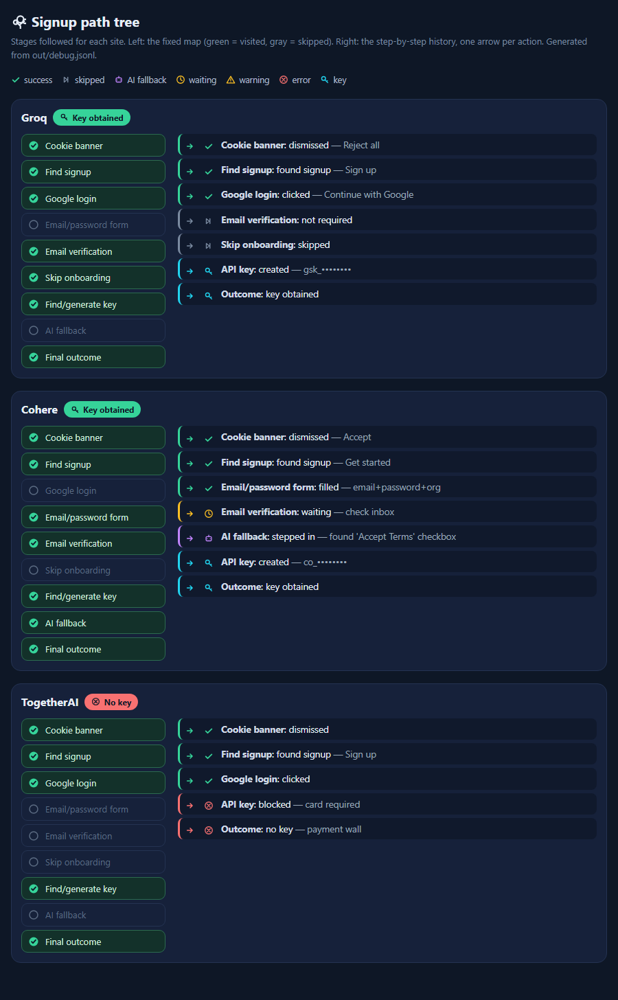

# auto-free-ai-api-farming

**Automates signing up for free-tier AI API keys** — Groq, OpenRouter, Cerebras, Mistral,
Cohere, Fireworks, DeepInfra, and 25+ more. Drives a real (or headless) Chrome/Chromium
session with Playwright, follows each site's signup flow, extracts the API key, and saves it
locally.

Works on both **English and Italian** UIs — matching uses semantic patterns (accessible
role, aria-label, visible text) with layered fallbacks instead of hardcoded exact strings, so
it degrades gracefully across languages instead of breaking on a locale mismatch.



*Every run produces a tree like this (`out/path.html`) — which stages were hit, which were
skipped, and where the AI fallback stepped in. Not the actual providers above; a synthetic
example for illustration.*

## How it works

```
     ┌──────────────┐     stuck?     ┌───────────────┐    resolved?    ┌────────────────┐
      1. Deterministic ───────────►    2. AI fallback  ───────────►     3. Learned recipe
      cookies, OAuth,                  Groq (text-only,                 replayed next time,
      forms, key page                  vision as last resort)           no AI call needed
     └──────────────┘                 └───────────────┘                └────────────────┘
```

1. **Deterministic first** (`farmer/forms.py`, `farmer/grabkey.py`, `farmer/cookies.py`,
   `farmer/oauth_text.py`) — cookie banners, login/signup buttons, Google/GitHub OAuth, and
   the common "create org / accept terms" onboarding form are all handled without AI, via
   cascading selector strategies: accessible-role match → visible text → attribute selectors
   → semantic keyword fallback.
2. **AI fallback** (`farmer/ai_fallback.py`) — when the deterministic path can't find the next
   step, a text-first LLM (Groq, no vision) reads a compact text rendering of the page
   (`farmer/page2text.py`) and picks one action: click / fill / check / goto. A vision tier
   (screenshot) kicks in only if the text-only agent gets stuck.
3. **Learns from the AI** (`farmer/learned.py`) — any action the AI resolves successfully is
   recorded as a deterministic "recipe" (page path + element type + action). Future runs
   replay the recipe first, skipping the AI call entirely.

**Status:** functional core (steps 1–2 work end-to-end on most sites), step 3 (learned
recipes) is implemented and unit-tested but not yet proven on a full live run — see
[Known limitations](#known-limitations).

## Quick start

```bash
pip install playwright
playwright install chromium

export SIGNUP_ACCOUNT="you@example.com"
export SIGNUP_PASSWORD="something-strong"
export SIGNUP_NAME="API Bot"
export GROQ_KEY="..."          # only needed for the AI fallback tier

python run.py                  # runs every site in data/sites.json + data/sites_extra.json
python run.py Cohere           # runs a single site
```

Collected keys are written to `out/keys.txt`. A visual trace of the path taken through each
site's UI is written to `out/path.html` (regenerate any time with `python tools/path_viewer.py`).

## Project layout

```
farmer/           the engine (import as a package)
  browser.py         Playwright context setup (profile, window, multi-account sub-profiles)
  cookies.py         cookie banner detection/dismissal
  forms.py           generic deterministic form filler (email/password/org/consents/submit)
  google_oauth.py    github_oauth.py    oauth_text.py    -- OAuth flows
  grabkey.py         API key extraction from the dashboard/settings page
  ai_fallback.py      Groq-backed text (then vision) fallback agent
  learned.py         AI-resolved actions replayed deterministically on later runs
  page2text.py       page -> compact text rendering (what the AI agent "sees")
  tree.py            orchestrates the full per-site flow
  registry.py sites.py  loads data/sites.json into the site registry
data/
  sites.json sites_extra.json   site registry: signup URL, key page, key regex, quirks
tools/
  path_viewer.py       renders out/path.html from a run's debug.jsonl
  page2text_demo.py    side-by-side site screenshot vs. page2text rendering, for debugging
tests/
  test_offline.py test_real_offline.py test_regression.py   fixture-based regression suite
fixtures/          static HTML snapshots used by the offline tests (no live network)
run.py             entry point
```

### Multiple accounts

Point `SIGNUP_PROFILE` at a separate Chrome sub-profile (`--profile-directory`) that's already
logged into a second Google account, and set `SIGNUP_ACCOUNT` to match. Google then auto-signs
into that account with no chooser prompt — no stored passwords, no 2FA risk.

```bash
export SIGNUP_PROFILE="secondary"
export SIGNUP_ACCOUNT="your-second-account@example.com"
python run.py Cohere
```

### Debugging what the AI "sees"

```bash
python tools/page2text_demo.py
```

Generates `out/page2text_demo.html`: screenshot side-by-side with the compact text rendering
passed to the LLM — useful for diagnosing why the AI fallback stalled on a given page.

## Configuration

- `data/sites.json` / `data/sites_extra.json` — the site registry. Add a new site by adding
  an entry here: signup URL, key page URL, key regex, OAuth provider, known quirks.
- Env vars: `SIGNUP_ACCOUNT`, `SIGNUP_PASSWORD`, `SIGNUP_NAME`, `SIGNUP_PROFILE`, `GROQ_KEY`,
  `SIGNUP_CHROMIUM` (use Chromium instead of installed Chrome, avoids profile conflicts with a
  Chrome window you already have open), `SIGNUP_SNAPSHOT` (auto-capture every page visited,
  for offline debugging/fixtures).

## Known limitations

- **Payment/card walls** are detected and skipped, not bypassed (by design).
- **React-controlled custom checkboxes** (some onboarding forms) can resist even a real
  Playwright click when off-screen; `forms.py` scrolls into view and falls back to a native
  mouse click, but a handful of heavily-customized forms still need a manual pass.
- **`learned.py` replay** is unit-tested (record → suggest round-trips correctly) but hasn't
  yet been proven to fully replace an AI call end-to-end on a live site — contributions
  welcome here.
- Sites change their UI regularly; a selector or regex in `data/sites.json` going stale is
  expected maintenance, not a design flaw.

## Ethics / ToS note

This automates account creation and API key retrieval. Only use it with accounts you own, and
review the target service's Terms of Service — some providers explicitly disallow automated
signups. This project is provided for personal/research use; you are responsible for how you
use it.

## Contributing

Issues and PRs welcome — especially around the AI-fallback learning loop, new site entries in
`data/sites.json`, and hardening the form-filling for React/custom-component sites.

## License

MIT — see [LICENSE](LICENSE).
